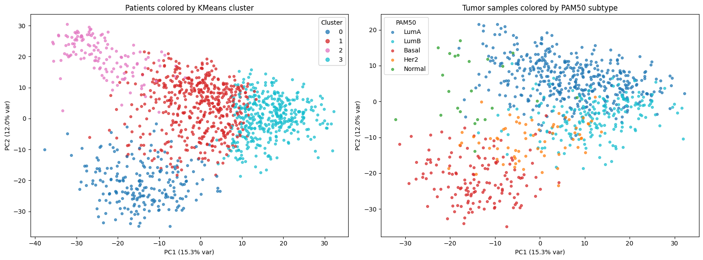

# Patient Stratification on TCGA-BRCA Gene Expression Data

**[Your Name]** · [your.email@example.com] · [LinkedIn]

An unsupervised patient stratification pipeline built on Databricks (PySpark + MLlib + MLflow), applied to TCGA breast cancer (BRCA) gene expression data. The pipeline clusters patients directly from expression profiles — with no clinical subtype labels used as input — and the resulting clusters are then validated against known PAM50 molecular subtypes and canonical breast cancer biomarkers.

## Why this matters

Translational and biomarker teams routinely need to ask: *do molecular profiles alone recover clinically meaningful patient groups, and which genes are driving that separation?* This project answers both questions on a real, public breast cancer cohort: clustering built purely from expression data recovers known tumor biology (PAM50 subtypes) and independently re-discovers established breast cancer biomarkers (ESR1, GATA3) — without ever supplying subtype labels to the model. That agreement between an unsupervised result and prior clinical knowledge is the core validation logic of this pipeline, and the pattern generalizes to biomarker discovery and cohort stratification problems more broadly.

## Pipeline overview

| Stage | What happens |
|---|---|
| 1. Ingest | TCGA-BRCA expression matrix (GDC hub, 1,226 samples) + clinical/PAM50 subtype calls (legacy Pan-Cancer hub), loaded into a Unity Catalog Volume |
| 2. Preprocess | Filtered to genes with mean expression ≥ 1.0 (13,224 of ~60k genes), ranked by variance, top 1,500 genes retained; stored in a narrow Delta schema |
| 3. Feature engineering | Per-gene standardization (mean 0, std 1) via Spark's `Summarizer` + a pandas UDF |
| 4. PCA + clustering | PCA (10 components, manual NumPy SVD) followed by KMeans (k=4) via MLlib; full run tracked in MLflow |
| 5. Validation | Silhouette score and Adjusted Rand Index against PAM50 subtypes |
| 6. Biomarker ranking | ANOVA F-statistic per gene across the 4 clusters, cross-checked against `scipy.stats.f_oneway` |
| 7. Visualization | Side-by-side PCA scatter, clusters vs. PAM50 subtype |
| 8. Decision framing | Markdown commentary throughout the notebook connecting each stage to a translational-team decision point |

Full implementation with inline commentary and outputs: [`notebooks/patient_stratification.ipynb`](notebooks/patient_stratification.ipynb)

## Headline results

- **Silhouette score: 0.358** — cluster separation, computed independently of any label
- **Adjusted Rand Index: 0.295** against PAM50 subtype calls — meaningful agreement between purely expression-driven clusters and known clinical subtypes, given PAM50 was never used as a model input
- **Basal subtype separates cleanly**, with one cluster reaching ~88% purity; Luminal A and Luminal B partially blend, consistent with their known biological similarity
- **Top-ranked biomarkers include ESR1 (ENSG00000091831) and GATA3 (ENSG00000107485)** — both established, clinically used breast cancer markers — recovered from unsupervised variance and clustering analysis with zero label information used upstream


*Left: patients colored by KMeans cluster. Right: same PCA space colored by PAM50 subtype. The visual agreement between panels mirrors the ARI result above.*

## Tech stack

Databricks (serverless / Spark Connect compute) · PySpark · MLlib · MLflow · Unity Catalog (managed Delta tables + Volumes) · NumPy · SciPy · scikit-learn · matplotlib

## Engineering notes

Two platform-specific issues came up during development and were worked around deliberately rather than avoided:

**Unity Catalog metadata registration hang.** An initial wide-table design (one column per gene, 1,500 columns) caused Unity Catalog metadata registration to hang. Fix: switched to a narrow Delta schema — one row per patient, gene values packed into a single `array<double>` column, with a separate `array_index → gene_id` mapping table. This is a more scalable pattern for high-dimensional omics data on Delta in general, not just a fix for this one run.

**Spark Connect ML model-size limit on MLlib Estimators.** Fitting MLlib's `StandardScaler` and `PCA` Estimators hit `CONNECT_ML.MODEL_SIZE_OVERFLOW_EXCEPTION` (268MB cap) despite the actual fitted output being roughly 24KB — a Databricks serverless/Spark Connect platform limitation, not a data or modeling issue. Fix: reimplemented scaling via Spark's `Summarizer` + a pandas UDF, and PCA via manual NumPy SVD, both validated against the expected MLlib behavior. KMeans itself ran without issue through the standard MLlib API, which helped confirm the problem was specific to certain higher-dimensional Estimator outputs rather than the platform generally. The standard MLlib API (`KMeans`, `ClusteringEvaluator`, `VectorAssembler`) is used everywhere it worked without issue — the manual paths are a targeted workaround, not a substitute for the standard tooling.

Both are documented inline in the notebook at the point they occur.

## Repo structure

```
expression-stratification-databricks/
├── README.md                          <- you are here
├── data/
│   └── README.md                      <- data sources, provenance, dictionary
├── notebooks/
│   └── patient_stratification.ipynb   <- full pipeline, all 8 stages, with outputs
├── screenshots/
│   └── pca_scatter.png
└── .gitignore
```

## Reproducing this

Raw data is not committed to this repo — see [`data/README.md`](data/README.md) for sources and how to load them into a Unity Catalog Volume.
